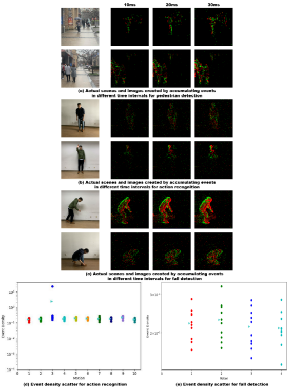
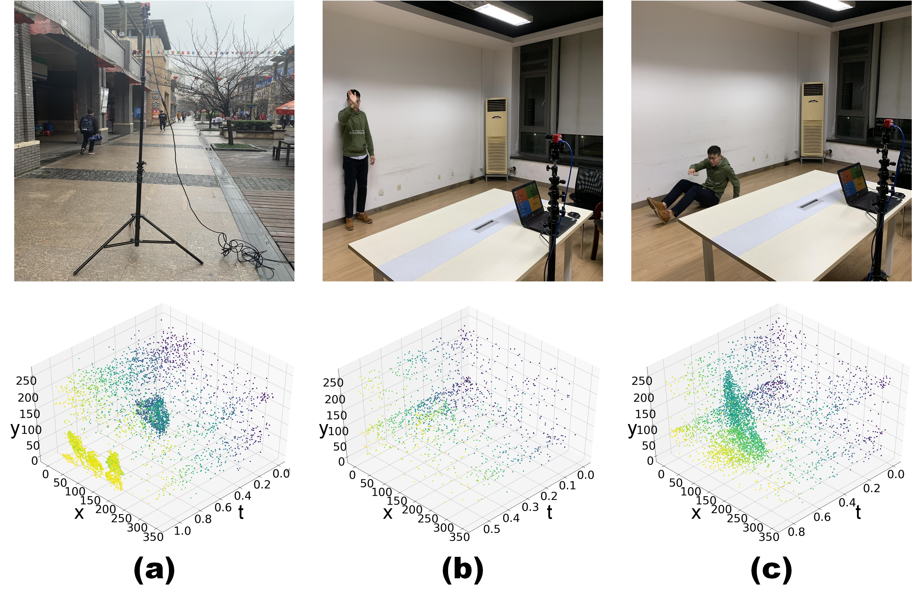
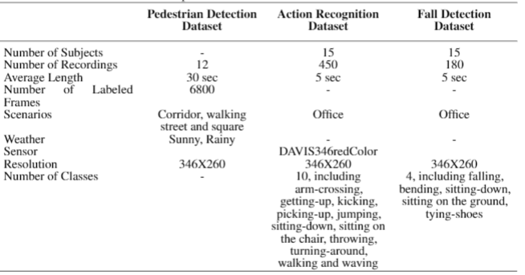
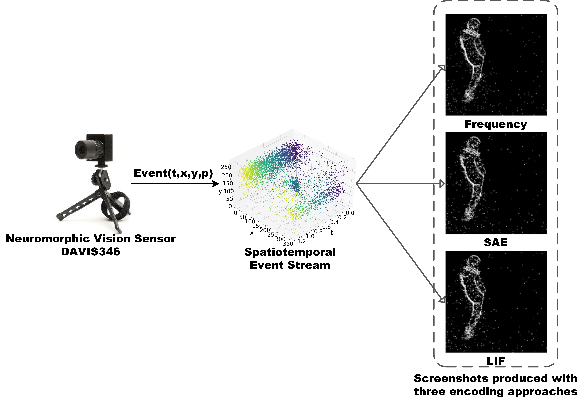

# Neuromorphic Benchmark Datasets for Pedestrian Detection, Action Recognition, and Fall Detection

**Shu Miao，Guang Chen，Xiangyu Ning，Yang Zi，Kejia Ren，Zhenshan Bing，Alois Knoll**

*Institute of Intelligent Vehicle, Tongji Unversity, Shanghai, China*

*Technical University Munich, Munich, Germany*

## Recording Scene and Equipment

### All datasets are recorded in the actual scenes, the recording scenarios are as shown.

### The characteristics of the three datasets are summarized in the following Table, and they are described in detail below.

## How to Get Datasets

We upload all the datasets to the cloud server. The user can click to download the datasets.

 - Pedestrian Detection Dataset [download](https://pan.baidu.com/s/1LBbyy7O5Y8ZpGZkQ2gy9eg)(Extraction code：e1eq) 

 - Action Recognition Dataset [download](https://pan.baidu.com/s/1ooGwdN2rH8IFmm-EBEGGCA)(Extraction code：p2sj)

- Fall Detection Dataset [download](https://pan.baidu.com/s/1mHFaDSNJU0iLvgQrZx9DKA) (Extraction code：m3f6)

### A large part of pedestrian detection raw data are converted to 6800 frame images through SAE encoding method with frame interval of 20ms. In our experiment, all these images have been labelled via annotation tool -labelImg.

## Ways of Encoding

Conventional methods cannot process event data directly. Thus, we employ three encoding approaches here as Frequency, SAE(Surface of Active Events) and LIF(Leaky60Integrate-and-Fire) to process continuous DVS event stream into a sequence of frame images, in order to fit for conventional deep learning algorithms. We provide our codes (in Python) respect to three encoding approaches shown in folders.

## Contacts

Questions about these datasets should be directed to:
guang@in.tum.de

## For further details please related to our paper. If you are going to use datasets, please refer to our article.