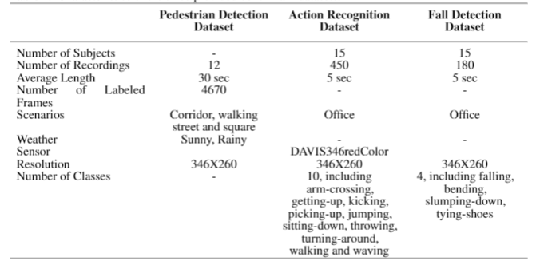

# Benchmark Datasets for Pedestrian Detection, Action Recognition, and Fall Detection

**Shu Miao，Guang Chen，Xiangyu Ning，Yang Zi**

*Institute of Intelligent Vehicle, Tongji Unversity, Shanghai, China*

## Recording Scene and Equipment

### The characteristics of the three datasets are summarized in the following Table, and they are described in detail below.

## How to Get Datasets

Because we upload all the data to the cloud server, if the user needs any dataset, you can click the corresponding download address.

 - Pedestrian Detection Dataset [download](https://pan.baidu.com/s/1bwVDdRl7Hk2CwB6O3PRg4Q) 

 - Action Recognition Dataset [download](https://pan.baidu.com/s/1KcsMFO1tejfQTkfd-4A-og) 

- Fall Detection Dataset [download](https://pan.baidu.com/s/1hYo6BPBd8m956ieXfVdCPQ) 

## How to Handle Datasets

Conventional methods cannot process event data directly. Thus, we employ three encoding approaches here as Frequency, SAE(Surface of Active Events) and LIF(Leaky60Integrate-and-Fire) to process continuous DVS event stream into a sequence of frame images, in order to fit for conventional deep learning algorithms. We provide our codes (in Python) respect to three encoding approaches shown in folders.

## Contacts

Questions about these datasets should be directed to:
guang@in.tum.de

## For further details please related to our paper. 