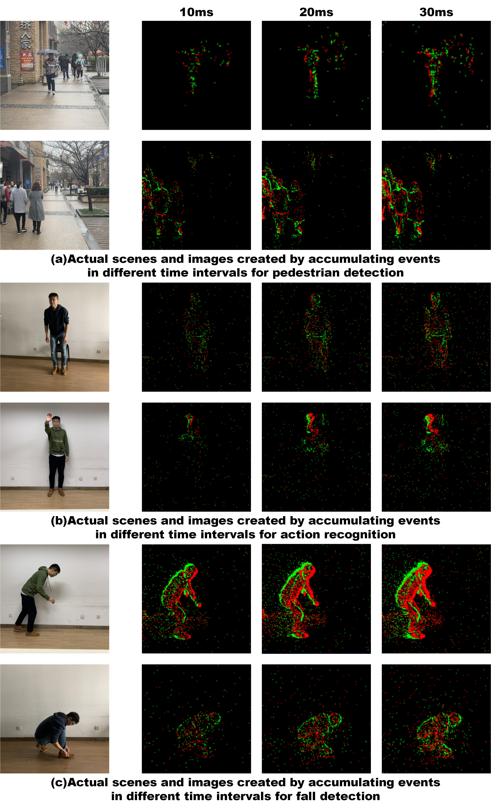

# Neuromorphic Vision Datasets for Pedestrian Detection, Action Recognition, and Fall Detection

**Shu Miao，Guang Chen，Xiangyu Ning，Yang Zi，Kejia Ren，Zhenshan Bing，Alois Knoll**

*Institute of Intelligent Vehicle, Tongji Unversity, Shanghai, China*

*Technical University Munich, Munich, Germany*

## Recording Scene and Equipment

### All datasets are recorded in the actual scenes, the recording scenarios are as shown.

### The characteristics of the three datasets are summarized in the following Table, and they are described in detail below.

## How to Get Datasets

We upload all the datasets to the cloud server. The user can click to download the datasets.

 - Pedestrian Detection Dataset [download](https://tongjieducn-my.sharepoint.com/:f:/g/personal/ziyang_tongji_edu_cn/EvESXgWV7b9An08TjqsxCeABirKt9JbnWo05QMb-rfpULQ?e=bggr5H)

 - Action Recognition Dataset [download](https://tongjieducn-my.sharepoint.com/:f:/g/personal/ziyang_tongji_edu_cn/EtbRTOGDf8tIgXZZK5Vkg6YB76Q2K1JS2a2NqyYiRjRrpA?e=1oCUiC)

- Fall Detection Dataset [download](https://tongjieducn-my.sharepoint.com/:f:/g/personal/ziyang_tongji_edu_cn/EmKnh-QyvZREl3f1Xc_A4_sBhfi2yUesyMJF4-eHXqk17g?e=QMxX) 

### A large part of pedestrian detection raw data are converted to 4670 frame images through SAE encoding method with frame interval of 20ms. In our experiment, all these images have been labelled via annotation tool -labelImg.

## Ways of Encoding

Conventional methods cannot process event data directly. Thus, we employ three encoding approaches here as Frequency, SAE(Surface of Active Events) and LIF(Leaky Integrate-and-Fire) to process continuous DVS event stream into a sequence of frame images, in order to fit for conventional deep learning algorithms. We provide our codes (in Python) respect to three encoding approaches shown in folders.

### How to use the three codes of encoding 

We provided a toy dataset file `toy.aedat` to verify our code for encoding. You can download this file, put it in your destination folder. 

We provides basic tutorials about the usage of three encoding codes.

If you want to use the code of snn.py,you can enter the following command.

`python snn.py /path/to/aedat/file`

If you want to use SAE and Frequency you can replace snn with sae or frequency.

## Contacts

Questions about these datasets should be directed to:
guang@in.tum.de

## For further details please related to our paper. If you are going to use datasets, please cite our article.

    @article{miao2019neuromorphic,
      title={Neuromorphic Benchmark Datasets for Pedestrian Detection, Action Recognition, and Fall Detection},
      author={Miao, Shu and Chen, Guang and Ning, Xiangyu and Zi, Yang and Ren, Kejia and Bing, Zhenshan and Knoll, Alois C},
      journal={Frontiers in neurorobotics},
      volume={13},
      pages={38},
      year={2019},
      publisher={Frontiers}
    }  

